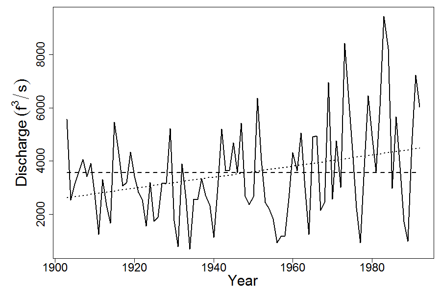

```{r, include = FALSE}
knitr::opts_chunk$set(
  collapse = TRUE,
  comment = "#>"
)
```

```{r setup}
library(arfit)
```

An example is bundled with the package. The example uses mean riverflow discharge data from USGS station #05464500 Cedar River at Cedar Rapids, IA. (For full details see @Beet_inprep)

The null model is fit:

\begin{equation}
  Y_t = \alpha + \epsilon_t  
\end{equation}

where $\epsilon_t = \phi\epsilon_{t-1} + Z_t$ is a stationary first order autoregressive process with $Z_t \sim N(0,\sigma^2)$

The alternative model is fit:

\begin{equation}
  Y_t = \alpha + \beta t + \epsilon_t  
\end{equation}

The parameters are estimated using maximum likelihood estimation. The log-likelihood is given as

\begin{align}
logL\left( \beta, \phi; \underline{y} \right ) = &constant + \frac{1}{2}log(1-\phi^2) \notag \\
&-\frac{n}{2}log\left( (1-\phi^2)(y_1-\beta)^2 + \sum^n_{t=2}(y_t - \phi y_{t-1}-t\beta + \phi(t-1)\beta)^2 \right) 
\end{align}


The log likelihoods are evaluated for each fitted model and likelihood ratio statistic is calculated as minus twice the difference between the likelihood under the null model and the alternative model.

\begin{equation}
  \Delta =  -2(logL_{H_0}-logL_{H_1}) 
\end{equation}

To evaluate the significance of the statistic, $\Delta$, a parametric bootstrap is performed. 
Simulate a new data set from the model fitted under the null. Fit the null and the alternative models to the simulated data and evaluate $\Delta_{boot}$. Repeat this simulation procedure a large number of times and estimate the significance level (P-value) by the proportion of simulated data sets for which the value of $\Delta_{boot}$ is larger than that of the observed data. 

For the Cedar Rapids example, 999 bootstrap samples are performed.

```{r cedar, echo = T,eval=F}
fits <- example_cedar_rapids(nBootSims = 999)
```

```{r fig,echo=F,eval=T}

```

