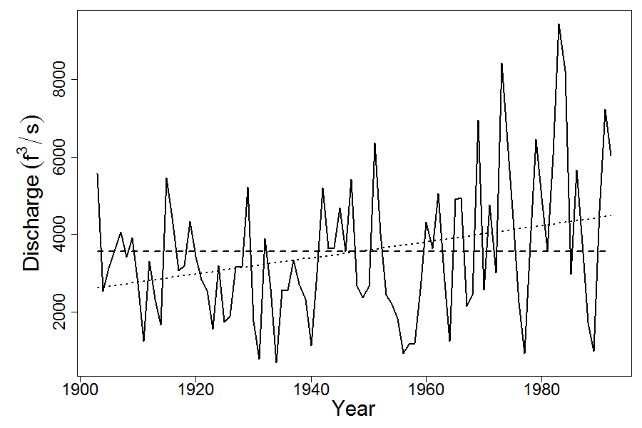

```{r setup, include=FALSE}
knitr::opts_chunk$set(echo = TRUE)
library(magrittr)
```

### Abstract

A test is introduced based on the likelihood ratio statistic combined with a parametric bootstrap to test for a linear trend in the presence of autocorrelation in the form of an AR(1) process. Small samples of size, n = 10, 25, 50 are of particular interest. Nominal levels are preserved for all levels of autocorrelation, trend and time series length. The power of the test behaves as expected with power declining as sample size decreases and autocorrelation increases.


Keywords: likelihood, likelihood ratio test, parametric bootstrap, autocorrelation, Hypothesis test

Authors: North East Fisheries Science Center (NOAA), Woods Hole, MA 02543

### Introduction

The specific model addressed here is of the form,

\begin{equation}
  Y_t = \beta_0 + \beta_1 t + \epsilon_t  
  (\#eq:one)
\end{equation}

where $\epsilon_t = \phi\epsilon_{t-1} + Z_t$ is a stationary first order autoregressive process with $Z_t \sim N(0,\sigma^2)$. Interest centers on testing the null hypothesis, $H_0:\beta_1 = 0$ against the alternative, $H_1:\beta_1 \neq 0$

Testing for a trend in time series data has been addressed by many authors from a wide range of disciplines including economics, statistics, hydrology, ecology, fisheries, and epidemiology; [@cochrane_application_1949; @prais_trend_1954; @beach_maximum_1978; @park_estimating_1980; @brillinger_trend_1994; @bence_analysis_1995; @woodward_improved_1997; @zhang_temperature_2000; @yue_influence_2002; @wang_linear_2015 ;@hardison_simulation_2019]. These approaches have typically taken one of three paths; non parametric methods such as the Mann Kendall test and its pre-whitening variants @hamed_modified_1998;  @zhang_temperature_2000; @yue_applicability_2002;  @wang_linear_2015); parametric methods involving data transformation such as @cochrane_application_1949, @prais_trend_1954, @woodward_improved_1997); parametric methods such as generalized least squares and maximum likelihood estimation (@beach_maximum_1978;  @davison_economic_1999, @pinheiro_mixed_2000). 

Is has been well documented that under the null hypothesis of no trend, $H_0:\beta=0$, in the presence of autocorrelation, parametric tests relying on asymptotic distribution theory reject the null hypothesis too frequently, leading to nominal significance levels that are too high, even for relatively long time series of length n = 100 (@woodward_improved_1997). Non parametric tests like those listed above also suffer the same problem. 

We introduce a test that, like @beach_maximum_1978, uses maximum likelihood for parameter estimation, but differs in that the significance of the likelihood ratio statistic, LR, is assessed via a parametric bootstrap (@efron_introduction_1993). Parametric bootstrap procedures have been used in some of the aforementioned work. @woodward_improved_1997 use an alternative statistic, the Cochrane-Orchutt statistic, for detecting a trend. @rayner_bootstrapping_1990 focuses on the significance of the AR(1) parameter and @bence_analysis_1995 focuses on adjusting confidence intervals. We use the parametric bootstrap as an alternative means of assessing the significance of the LR statistic.

### Methods

We define the likelihood function as,

\begin{equation}
\mathrm{L}\left( \underline{\theta}; \underline{y} \right )= \prod^n_{t=2} p\left(Y_t = y_t | Y_{t-1}=y_{t-1}\right)  p\left(Y_1=y_1 \right) (\#eq:two)
\end{equation}

where $\underline{\theta} = (\beta_0,\beta_1, \phi\, \sigma^2)$ and $p\left(Y_t = y_t | Y_{t-1}=y_{t-1}\right)$ is the conditional distribution of $y_t$ given $y_{t-1}$ and $p\left(Y_1=y_1 \right)$ is the distribution of the first point. For the model \@ref(eq:one) the log likelihood is given by

\begin{align}
logL\left( \underline{\theta}; \underline{y} \right ) = & -\frac{n}{2}log2\pi - nlog\sigma^2 + \frac{1}{2}log(1-\phi^2) \notag \\
& -\frac{1}{2\sigma^2}\left( (1-\phi^2)(y_1-\beta_0-\beta_1)^2 + \sum^n_{t=2}(y_t - \phi y_{t-1}-\beta_0(1-\phi^2) -t\beta_1 + \phi(t-1)\beta_1)^2 \right) (\#eq:three)
\end{align}


Differentiating $logL\left( \underline{\theta}; \underline{y} \right )$ with respect to $\sigma$ and equating to zero yields the maximum likelihood estimator,


\begin{equation}
\hat\sigma^2 = \frac{1}{n}\left( (1-\phi^2)(y_1-\beta_0-\beta_1)^2 + \sum^n_{t=2}(y_t - \phi y_{t-1}-\beta_0(1-\phi^2) - t\beta_1 + \phi(t-1)\beta_1)^2 \right) (\#eq:four)
\end{equation}

Substituting $\hat\sigma^2$ into \@ref(eq:two) yields the log likelihood function as a function of $\underline{\beta}=(\beta_0,\beta_1)$ and $\phi$


\begin{align}
logL\left( \underline{\beta}, \phi; \underline{y} \right ) = &const. + \frac{1}{2}log(1-\phi^2) \notag \\
&-\frac{n}{2}log\left( (1-\phi^2)(y_1-\beta_0-\beta_1)^2 + \sum^n_{t=2}(y_t - \phi y_{t-1}-\beta_0(1-\phi^2)-t\beta_1 + \phi(t-1)\beta_1)^2 \right) \\ 

&= const. + \frac{1}{2}log(1-\phi^2) \notag \\
&-\frac{n}{2}log\left( (1-\phi^2)(y_1-X_1\underline{\beta})^2 + \sum^n_{t=2}(y_t - \phi y_{t-1}-X_t\underline{\beta} + \phi X_{t-1}\underline{\beta})^2 \right) (\#eq:five)
\end{align}


The maximum likelihood estimates for $\underline{\beta}$ and $\phi$ are the values for which \@ref(eq:five) is maximized. This is akin to a Generalized Least Squares problem with an unknown covariance matrix, but with a known covariance structure. Maximization is achieved numerically and there are several ways to achieve this (@beach_maximum_1978;  @pinheiro_mixed_2000).

It is natural to test $H_0:\beta_1=0$ against $H_1: \beta_1 \neq 0$, using the likelihood ratio (LR) statistic (@silvey_statistical_1980). The LR statistic, $\Delta$, is defined as minus twice the difference of the maximized value of the log-likelihood under $H_0$ and the maximized value of the log-likelihood under $H_1$. To form $\Delta$, it is necessary to fit the model \@ref(eq:one) by maximum likelihood \@ref(eq:five) under both $H_0$ and $H_1$.

The significance of the observed value of the LR statistic, $\Delta$ can be assessed through the following procedure. Simulate a new data set from the model fitted under the null. Fit the null and the alternative models to the simulated data and find the value of and evaluate $\Delta$. Repeat this simulation procedure a large number of times and estimate the significance level (P-value) by the proportion of simulated data sets for which the value of $\Delta$ is larger than that of the observed data. This is an example of a parametric bootstrap test (@efron_introduction_1993).

### Simulation study

To assess the validity of the test we present some results from a larger simulation study. We used values of the trend, $\beta_1$ = 0, 0.12, 0.25, 0.5, the autoregressive parameter, $\phi$ = 0, 0.25, 0.5, 0.75, 0.95, the standard deviation of Gaussian process, $\sigma$ = 0.25, 0.5, 0.75 with time series of length n = 10, 25, 50. We simulated 200 data sets for all combinations of the parameters above and 499 bootstrap samples. Nominal significance levels, testing at the 5% level, along with results using distributional theory are shown in Table \@ref(tab:table1). To ensure that the error time series is stationary, $\epsilon_1$ is drawn from  $N\left(0,\frac{\sigma^2}{(1-\phi^2)}\right)$.

When $H_0$ is true ($\beta_1 = 0$), for the test to be valid, all entries in Table \@ref(tab:table1) should be close to 0.05 (±2 se, se=0.0154) when testing at the 5% significance level.  As can be seen from the results in Table \@ref(tab:table1), the significance levels from distributional theory are too liberal for small values of n. As $\phi \to 1$ the significance levels are too liberal for all values of n. However if n was large “enough”, the nominal levels would tend towards the true significance levels regardless of the level of $\phi$. In practice time series of the lengths required for this convergence are rarely observed. The bootstrap test presented does not suffer from this problem. The nominal levels are respectable for all sample sizes and all levels of autocorrelation, with the exception of very highly correlated data and small n (n = 10,  $\phi$ = 0.95). At this point the nominal levels are within 3 standard errors

The power of the test is assessed when $H_1$ is true. Tables \@ref(tab:table2), \@ref(tab:table3), and \@ref(tab:table4) show the results. As one would expect, the test loses power as the number of observations are reduced. Power is also lost as the magnitude of the trend relative to the variance of the Gaussian errors decreases along with an increase in level of autocorrelation. Despite this the test still has acceptable power to detect trend in the presence of autocorrelation.


### Application to Hydrological Data

As an illustration, the test outlined above was applied to an annual riverflow discharge time series (Figure \@ref(fig:figure1)) from Cedar Rapids, IA (USGS station #05464500). The data is available from https://waterdata.usgs.gov. @hamed_modified_1998 used the same data set to apply their modified Mann-Kendall test for trend for which they conclude that there is insufficient evidence to reject the null hypothesis. We find a result to the contrary. The value of the LR statistic $\Delta$ is 4.427. Of 1000 bootstrap samples simulated from the model fitted under the null 46 had values in excess of $\Delta$ for an estimated significance level of .046 with standard error around 0.007. The Model fits under the null and alternative are shown in Figure \@ref(fig:figure1). Parameter estimates under the null are $\hat\beta_0$ = 3560, $\hat\phi$ = .37, $\hat\sigma$ = 1670. Under the alternative $\hat\beta_0$ = 2602, $\hat\beta_1$ = 20.88, $\hat\phi$ = .30, $\hat\sigma$ = 1630.

```{r figure1, eval = TRUE, echo =FALSE, out.width='70%', fig.align='center',fig.cap='Annual river flow discharge from Cedar Rapids, IA (USGS station \\#05464500). Dashed line shows model fit under $H_0$:$\\beta_1 = 0$, dotted line shows model fit under $H_1$: $\\beta_1$ $\\neq 0$'}


```


### Discussion

Ignoring autocorrelation in the error process can drastically inflate type I errors. In fact even if we account for autocorrelation in the model and assess significance using standard distributional theory, type I errors are inflated (@woodward_improved_1997). As  @bence_analysis_1995 points out, this is well known but often ignored and methods relying on correcting confidence intervals typically under correct. The reason being that the estimate of autocorrelation is biased. In the AR(1) case, it is well known (@woodward_improved_1997) that the maximum likelihood estimate of the autoregressive parameter exhibits a bias toward 0 and away from the non-stationary region.

We have shown that by using a parametric bootstrap procedure to assess significance we can remedy the inflated type I error. While the estimate of autocorrelation is still biased, the test presented performs well. One might naturally ask how well the test performs if the autocorrelation is misspecified, for example if the underlying error structure is of a form other than that of an AR(1) process. To assess this we performed a simulation study using an autoregressive process of order 2. Preliminary simulation results suggest that the test is somewhat robust to such an alternative. Stationary AR(2) processes were simulated in the absence of a trend. The test rejects the null at the nominal significance level (Table \@ref(tab:table5)) for small values of $\phi_2$. The test begins to reject the null at levels slightly larger (10%) than the nominal level as $\phi_2$ increases and the process tends towards non-stationarity. 


### References

<div id="refs"></div>

### Tables

```{r table1, eval = T, echo = F}

df <- read.csv("tables/table1.csv",header = FALSE,skip=2)

df %>%
  kableExtra::kbl(.,col.names=c("$\\phi$",rep(c(" ","AR"),(ncol(df)-1)/2)),caption="Nominal levels under $H_0: \\beta_1 = 0$. Autoregressive parameter, $\\phi$ = 0, 0.25, 0.5, 0.75, 0.95. Time series length n = 10, 25, 50 and $\\sigma$ = 0.25, 0.5. The significance level from asymptotic result (AR) is also shown.",escape=F) %>%
  kableExtra::kable_styling(bootstrap_options = c("striped", "hover")) %>%
  kableExtra::column_spec(1,border_right = T) %>%
  kableExtra::add_header_above(c(" "=1 ,"n = 10"=2,"25"=2,"50"=2,"10"=2,"25"=2,"50"=2)) %>%
  kableExtra::add_header_above(c(" "=1 ,"$\\\\sigma$ = 0.25"= 6,"$\\sigma$ = 0.5"=6),escape=F)


```

```{r table2, eval = T, echo = F}

df <- read.csv("tables/table2.csv",header = FALSE)
df2a <- df[,1:10]

df2a %>%
  kableExtra::kbl(.,col.names=c(paste("$\\phi$"), rep(" ",(ncol(df2a)-1))),caption="Power of the test under $H_1: \\beta_1$ = 0.12, 0.25, 0.5. Autoregressive parameter, $\\phi$ = 0, 0.25, 0.5, 0.75, 0.95. Time series length n = 10, 25, 50 and $\\sigma$ = 0.25",escape=F) %>%
  kableExtra::kable_styling(bootstrap_options = c("striped", "hover")) %>%
  kableExtra::add_header_above(c(" "= 1, "$\\\\beta_1$ = .12"=1, ".25"=1, ".50"=1, ".12"=1, ".25"=1, ".50"=1, ".12"=1, ".25"=1, ".50"=1),escape=F) %>%
  kableExtra::add_header_above(c(" "=1 ,"n = 10"=3,"25"=3,"50"=3)) %>%
  kableExtra::column_spec(1,border_right = T)


```

```{r table3, eval = T, echo = F}

df <- read.csv("tables/table2.csv",header = FALSE)
df2b <- df[,c(1,11:19)]

df2b %>%
  kableExtra::kbl(.,col.names=c(paste("$\\phi$"), rep(" ",(ncol(df2b)-1))),caption="Power of the test under $H_1: \\beta_1$ = 0.12, 0.25, 0.5. Autoregressive parameter, $\\phi$ = 0, 0.25, 0.5, 0.75, 0.95. Time series length n = 10, 25, 50 and $\\sigma$ = 0.50",escape=F) %>%
  kableExtra::kable_styling(bootstrap_options = c("striped", "hover")) %>%
  kableExtra::add_header_above(c(" "= 1, "$\\\\beta_1$ = .12"=1, ".25"=1, ".50"=1, ".12"=1, ".25"=1, ".50"=1, ".12"=1, ".25"=1, ".50"=1),escape=F) %>%
  kableExtra::add_header_above(c(" "=1 ,"n = 10"=3,"25"=3,"50"=3)) %>%
  kableExtra::column_spec(1,border_right = T)
```

```{r table4, eval = T, echo = F}

df <- read.csv("tables/table2.csv",header = FALSE)
df2c <- df[,c(1,20:28)]

df2c %>%
  kableExtra::kbl(.,col.names=c(paste("$\\phi$"), rep(" ",(ncol(df2c)-1))),caption="Power of the test under $H_1: \\beta_1$ = 0.12, 0.25, 0.5. Autoregressive parameter, $\\phi$ = 0, 0.25, 0.5, 0.75, 0.95. Time series length n = 10, 25, 50 and $\\sigma$ = 0.75",escape=F) %>%
  kableExtra::kable_styling(bootstrap_options = c("striped", "hover")) %>%
  kableExtra::add_header_above(c(" "= 1, "$\\\\beta_1$ = .12"=1, ".25"=1, ".50"=1, ".12"=1, ".25"=1, ".50"=1, ".12"=1, ".25"=1, ".50"=1),escape=F) %>%
  kableExtra::add_header_above(c(" "=1 ,"n = 10"=3,"25"=3,"50"=3)) %>%
  kableExtra::column_spec(1,border_right = T)
```


```{r table5, eval = T, echo = F}

df <- read.csv("tables/table3.csv",header=F)
df[is.na(df)] <- ""

df %>%
  kableExtra::kbl(.,col.names=c(paste("$\\phi_1$"), rep(" ",(ncol(df)-1))),caption="Nominal levels under $H_0: \\beta_1 = 0$ with AR(2) errors. Autoregressive parameter, $\\phi_1$ = 0.1, 0.3, 0.5, 0.7 and $\\phi_2$ = 0.1, 0.2, 0.5, 0.7. Time series length n = 10, 25 and $\\sigma$ = 0.25.",escape=F) %>%
  kableExtra::kable_styling(bootstrap_options = c("striped", "hover")) %>%
  kableExtra::add_header_above(c(" "= 1, "$\\\\phi_2$ = .1"=1, ".2"=1, ".5"=1, ".7"=1, ".1"=1,".2"=1, ".5"=1, ".7"=1),escape=F) %>%
  kableExtra::add_header_above(c(" "=1 ,"n = 10"=4,"25"=4)) %>%
  kableExtra::column_spec(1,border_right = T)
```
